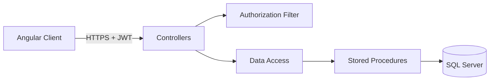

# Nexo Inventory — API

API REST para un sistema empresarial de control de inventario. Gestiona activos, usuarios y cuentas, y expone autenticación mediante tokens JWT.

> Este repositorio contiene el backend ASP.NET. La experiencia web se encuentra en [FrontInventario](https://github.com/itzlala/FrontInventario).

## Capacidades

- CRUD de activos de inventario.
- Administración de personas vinculadas al inventario.
- Autenticación del lado del servidor mediante `POST /api/auth/login`.
- Tokens JWT firmados con HMAC SHA-256 y ocho horas de vigencia.
- Protección de endpoints mediante encabezado `Authorization: Bearer`.
- Swagger para explorar el contrato de la API.
- CORS limitado al origen configurado.

## Tecnologías

| Área | Tecnología |
| --- | --- |
| Plataforma | ASP.NET Web API 2 / .NET Framework 4.8 |
| Lenguaje | C# 7.3 |
| Persistencia | SQL Server y procedimientos almacenados |
| Documentación | Swagger / Swashbuckle |
| Seguridad | JWT HS256 y autorización por filtro |

## Arquitectura



## Configuración local

Requisitos: Visual Studio con herramientas para ASP.NET, .NET Framework 4.8 y SQL Server.

1. Restaura los paquetes NuGet y abre `ProyectoWebApi.sln`.
2. Configura la conexión mediante `NEXO_DB_CONNECTION` o la entrada `InventarioDb` de `Web.config`.
3. Define una clave privada de al menos 32 caracteres:

```powershell
$env:NEXO_JWT_SECRET = "una-clave-privada-larga-y-generada-de-forma-segura"
```

4. Ajusta `AllowedOrigin` si el frontend no se ejecuta en `http://localhost:4200`.
5. Ejecuta el proyecto con IIS Express. Swagger estará disponible en `/swagger`.

Nunca publiques una cadena de conexión o una clave JWT real en el repositorio.

## Endpoints principales

| Método | Ruta | Descripción | Autenticación |
| --- | --- | --- | --- |
| `POST` | `/api/auth/login` | Inicia sesión y emite un JWT | No |
| `GET` | `/api/inventario` | Lista activos | Sí |
| `POST` | `/api/inventario` | Registra un activo | Sí |
| `PUT` | `/api/inventario` | Actualiza un activo | Sí |
| `DELETE` | `/api/inventario/{id}` | Elimina un activo | Sí |
| `GET` | `/api/usuario` | Lista usuarios | Sí |
| `GET` | `/api/cuenta` | Lista cuentas sin contraseñas | Sí |

Ejemplo de autenticación:

```http
POST /api/auth/login
Content-Type: application/json

{
  "Usuario": "admin",
  "Contrasenia": "••••••••"
}
```

## Consideración sobre contraseñas heredadas

La base académica original almacena credenciales con el esquema existente. La renovación evita exponerlas al navegador y realiza la validación exclusivamente en el servidor. Para una publicación real, el siguiente paso recomendado es migrar la tabla a hashes adaptativos —por ejemplo, Argon2id o bcrypt— y aplicar el cambio de manera gradual al iniciar sesión.

## Autor

Proyecto académico y de portafolio desarrollado por [itzlala](https://github.com/itzlala).
